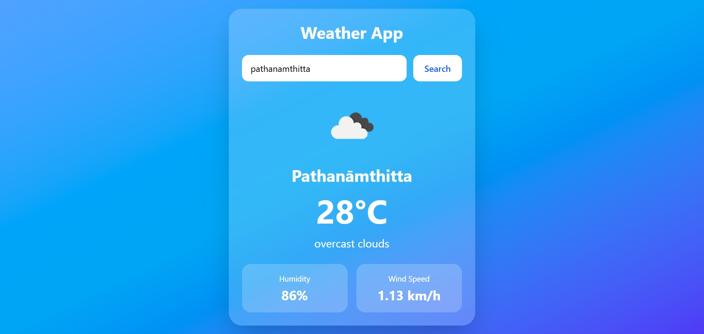

# 🌦️ Weather App

A simple and responsive Weather Application built using **HTML**, **Tailwind CSS**, and **JavaScript**. This app allows users to search for any city and view real-time weather information such as temperature, weather conditions, humidity, and wind speed using a weather API.

## Preview


## Live at
[live@]()

## 🚀 Features

* Search weather by city name
* Displays current temperature
* Shows weather condition and icon
* Humidity and wind speed information
* Responsive design for mobile and desktop
* Clean and modern UI with Tailwind CSS
* Error handling for invalid city names

## 🛠️ Technologies Used

* HTML5
* Tailwind CSS
* JavaScript (ES6)
* Weather API (e.g., OpenWeatherMap)

## 🔑 API Setup

1. Create an account on OpenWeatherMap.
2. Generate an API key.
3. Replace the API key in `script.js`:

```javascript
const apiKey = "YOUR_API_KEY";
```

